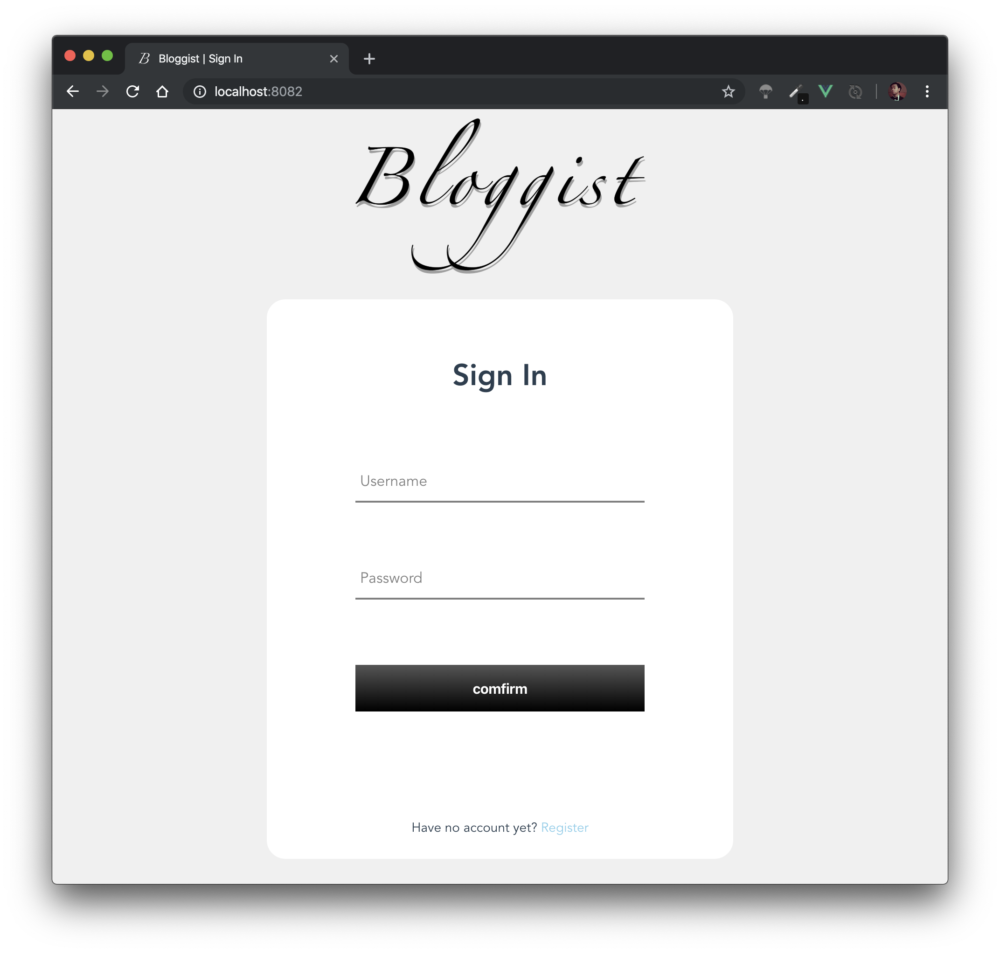
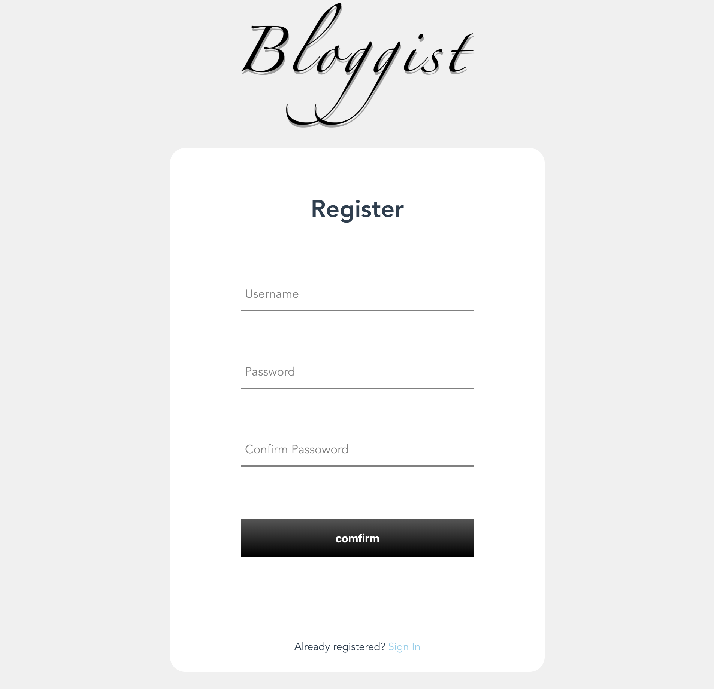
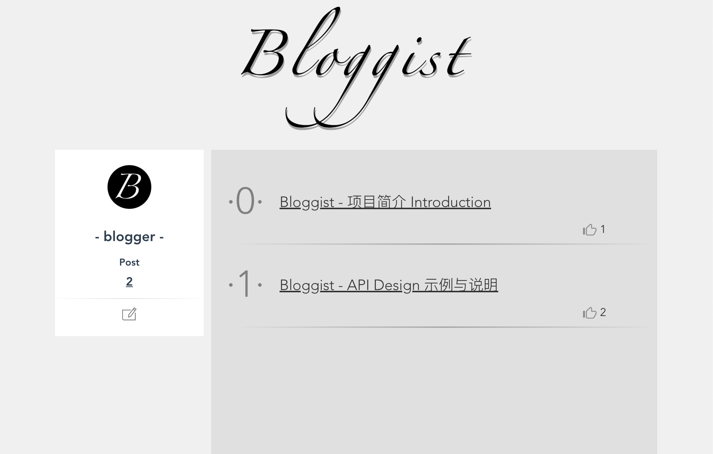
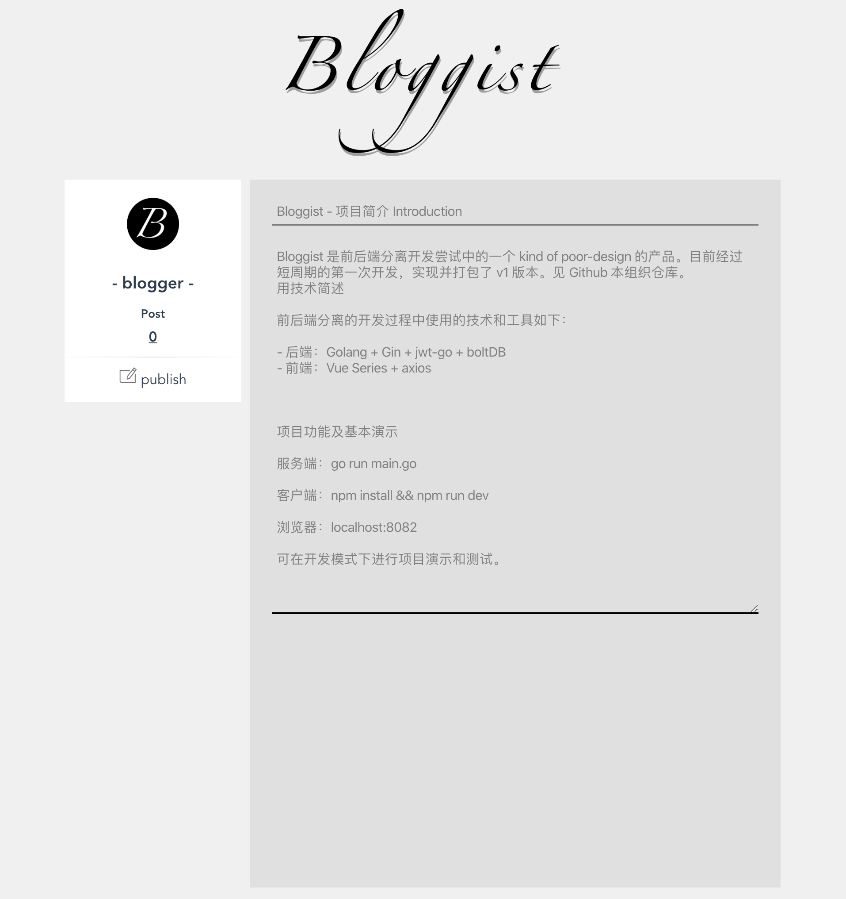

# Bloggist - 项目简介 Introduction

> Bloggist 是前后端分离开发尝试中的一个 kind of poor-design 的产品。目前经过短周期的第一次开发，实现并打包了 v1 版本。见 Github 本组织仓库。

## 项目使用技术简述

前后端分离的开发过程中使用的技术和工具如下：

- 后端：Golang + Gin + jwt-go + boltDB
- 前端：Vue Series + axios

## 项目功能及基本演示

### 项目功能

初代十分简陋的 Bloggist 支持：

- 用户进行注册；
- 用户进行登陆；
- 用户发表博客；
- 用户浏览博客；
- 用户对博客发起点赞；

服务端：`go run main.go`

客户端：`npm install && npm run dev`

浏览器：`localhost:8082`

可在开发模式下进行项目演示和测试。

### 页面效果演示

#### index 页面

#### 注册页面

#### 个人主页

#### 发表博客页面

